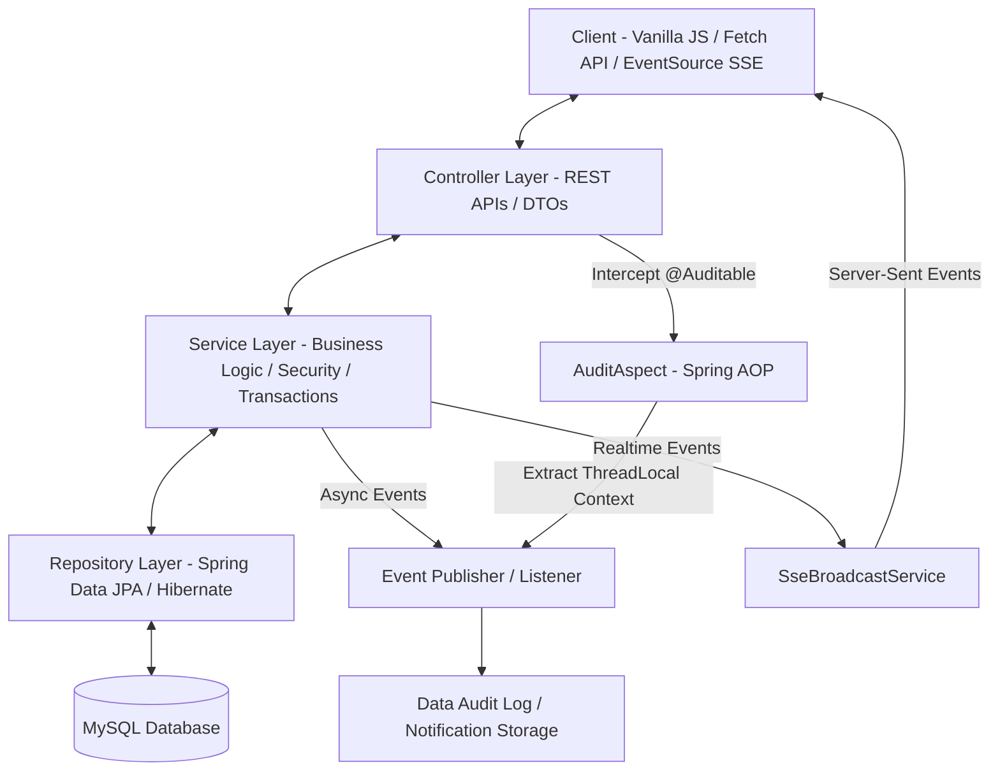
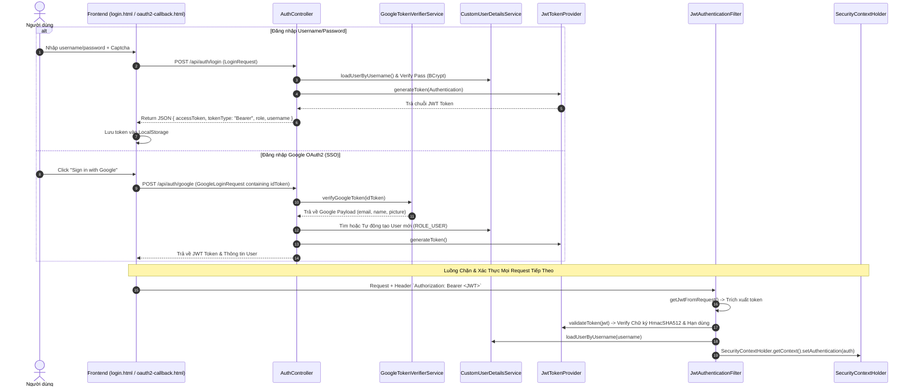
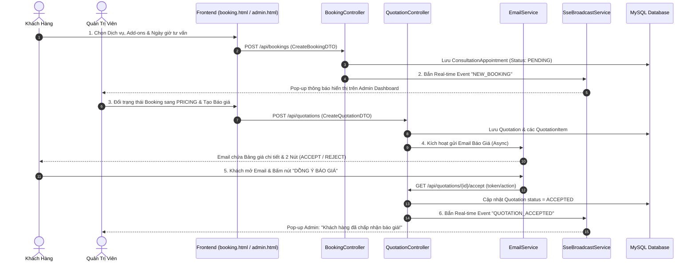
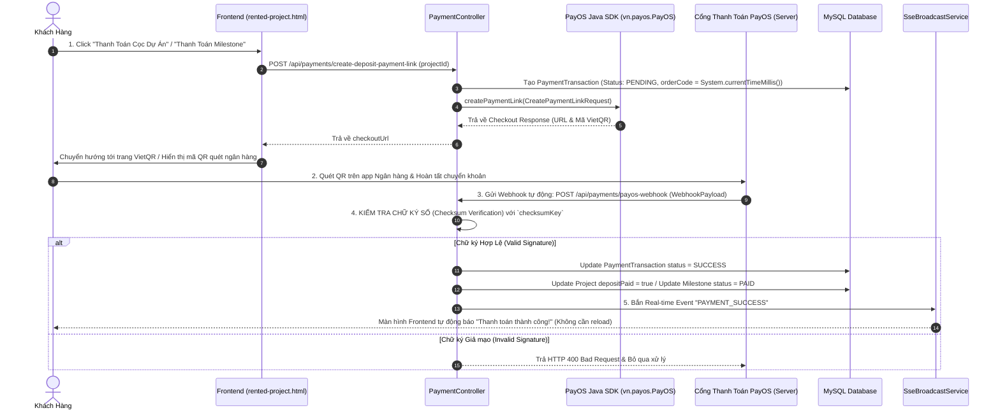
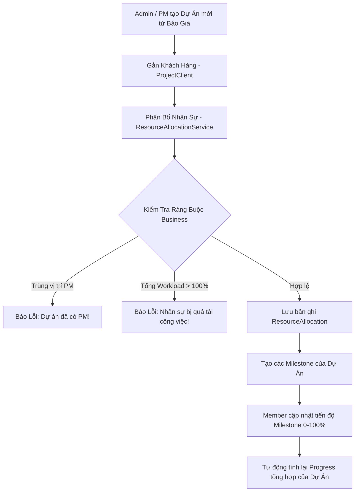
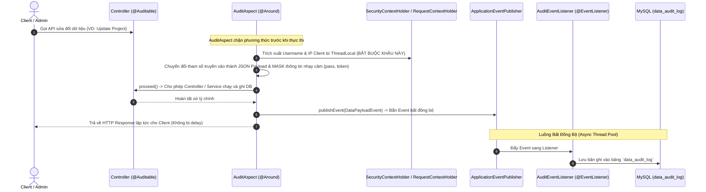
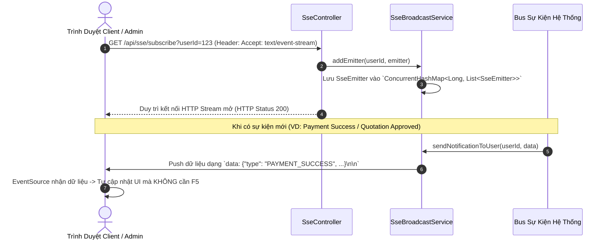

# 🎓 TÀI LIỆU TỔNG HỢP GIẢI THÍCH CODE & LUỒNG HOẠT ĐỘNG THỰC TẾ
## 🚀 BỘ TÀI LIỆU CHUẨN BỊ BẢO VỆ ĐỒ ÁN / THUYẾT TRÌNH FINAL (NOVA DIGITAL CMS)

---

## 📌 PHẦN 1: TỔNG QUAN KIẾN TRÚC HỆ THỐNG & ĐIỂM SÁNG CÔNG NGHỆ

### 1. Mô Hình Kiến Trúc Lớp (Layered Architecture & Pattern)
Hệ thống được phát triển theo mô hình **Enterprise 3-Tier Layered Architecture** kết hợp **AOP (Aspect-Oriented Programming)** và **Event-Driven Architecture**:

### 2. Tech Stack Lõi
* **Backend**: Java 17, Spring Boot 4.1.0 / 3.x, Spring Data JPA (Hibernate), Spring Security (Stateless JWT Filter), Spring AOP, Spring Web SSE (`SseEmitter`).
* **Frontend**: HTML5, Vanilla CSS3 (Custom Glassmorphism Theme System), Vanilla JavaScript (ES6+ `async/await`, Fetch API, SSE `EventSource`), Chart.js.
* **Tích hợp bên thứ ba (Third-party Integrations)**:
  * **PayOS SDK (`vn.payos:payos-java`)**: Tạo mã VietQR thanh toán tự động & xử lý Webhook xác thực chữ ký Checksum.
  * **Google OAuth2 Client API**: Xác thực SSO bằng Google ID Token (`GoogleTokenVerifierService`).
  * **Spring Starter Mail (SMTP)**: Gửi email tự động xác nhận đặt lịch, email báo giá định dạng HTML và OTP khôi phục mật khẩu.

---

## 🔑 PHẦN 2: LUỒNG 1 - XÁC THỰC & PHÂN QUYỀN (JWT, GOOGLE OAUTH2, RBAC & SECURITY)

### 1. Mô Tả Luồng Hoạt Động

### 2. Các File & Dòng Code Trọng Tâm
1. [JwtAuthenticationFilter.java](file:///c:/Users/anngu/Documents/GitHub/NovaDigital_CMS_Workspace/src/main/java/com/example/demo/config/JwtAuthenticationFilter.java):
   * Phương thức `doFilterInternal()` (Dòng 27–47): Chặn mọi HTTP Request, kiểm tra Header `Authorization: Bearer <token>`, trích xuất username, nạp đối tượng `Authentication` vào `SecurityContextHolder`.
2. [JwtTokenProvider.java](file:///c:/Users/anngu/Documents/GitHub/NovaDigital_CMS_Workspace/src/main/java/com/example/demo/config/JwtTokenProvider.java):
   * `generateToken()`: Sinh token mã hóa chứa `username`, thời điểm tạo và thời điểm hết hạn (Expiration).
   * `validateToken()`: Giải mã và bắt các ngoại lệ JWT (`ExpiredJwtException`, `MalformedJwtException`, `SignatureException`).
3. [SecurityConfig.java](file:///c:/Users/anngu/Documents/GitHub/NovaDigital_CMS_Workspace/src/main/java/com/example/demo/config/SecurityConfig.java):
   * Cấu hình phân quyền URL:
     * `/api/admin/**` ➔ Yêu cầu `ROLE_ADMIN`.
     * `/api/member/**` ➔ Yêu cầu `ROLE_MEMBER` hoặc `ROLE_ADMIN`.
     * `/api/user/**`, `/api/bookings/**` ➔ Yêu cầu người dùng đã đăng nhập.
     * Thêm filter `JwtAuthenticationFilter` đứng trước `UsernamePasswordAuthenticationFilter`.
4. [GoogleTokenVerifierService.java](file:///c:/Users/anngu/Documents/GitHub/NovaDigital_CMS_Workspace/src/main/java/com/example/demo/service/GoogleTokenVerifierService.java):
   * `verifyGoogleToken()`: Sử dụng thư viện `GoogleIdTokenVerifier` của Google để xác thực tính hợp lệ của `idToken` từ Google Server, tránh việc client gửi token giả mạo.

---

### 💬 BỘ CÂU HỎI THƯỜNG GẶP BẢO VỆ (Q&A - PHẦN AUTH & SECURITY)

> **Q1: Tại sao hệ thống lại sử dụng Stateless JWT Authentication mà không dùng HTTP Session truyền thống?**
> * **Trả lời**: 
>   1. **Khả năng mở rộng (Scalability)**: Server không cần lưu trữ session state trong bộ nhớ (RAM), giúp hệ thống dễ dàng mở rộng theo chiều ngang (Horizontal Scaling) hoặc triển khai theo kiến trúc Microservices/Serverless.
>   2. **Phù hợp với SPA (Single Page Application)**: Frontend (Vanilla JS) giao tiếp hoàn toàn qua RESTful API không trạng thái (Stateless).
>   3. **Bảo mật Cross-Domain**: Tránh được nguy cơ tấn công CSRF (Cross-Site Request Forgery) mặc định của Session-Cookie vì Token được gửi qua Header `Authorization`.

> **Q2: Cơ chế hoạt động của `JwtAuthenticationFilter` là gì? Tại sao lớp này lại kế thừa `OncePerRequestFilter`?**
> * **Trả lời**: `OncePerRequestFilter` đảm bảo filter này **chỉ được kích hoạt đúng 1 lần duy nhất** cho mỗi HTTP Request gửi đến Server (kể cả khi request được forward trong servlet container). Filter sẽ trích xuất token từ Header `Authorization: Bearer <token>`, gọi `JwtTokenProvider.validateToken()` để kiểm tra chữ ký HMAC. Nếu hợp lệ, nó giải mã lấy `username`, load quyền (`Authorities`) từ `CustomUserDetailsService` và thiết lập vào `SecurityContextHolder` để Spring Security cho phép request truy cập tài nguyên được bảo vệ.

> **Q3: Cơ chế đăng nhập bằng Google OAuth2 (SSO) xử lý thế nào để tránh nguy cơ bảo mật giả mạo Token?**
> * **Trả lời**: Frontend nhận `idToken` từ Google Sign-In SDK rồi gửi lên API `/api/auth/google`. Phía Backend **KHÔNG TIN TƯỞNG** dữ liệu thô gửi lên mà bắt buộc dùng `GoogleTokenVerifierService` gọi `GoogleIdTokenVerifier` với Client ID chính thức của hệ thống để verify chữ ký số RSA từ Server của Google. Sau khi xác thực token thật, Backend mới lấy email, tìm hoặc tạo tài khoản User và cấp JWT token riêng của hệ thống.

---

## 📅 PHẦN 3: LUỒNG 2 - ĐẶT LỊCH TƯ VẤN & BÁO GIÁ TỰ ĐỘNG (BOOKING & QUOTATION SYSTEM)

### 1. Mô Tả Luồng Hoạt Động

### 2. Các File & Dòng Code Trọng Tâm
1. [BookingController.java](file:///c:/Users/anngu/Documents/GitHub/NovaDigital_CMS_Workspace/src/main/java/com/example/demo/controller/BookingController.java):
   * `createAppointment()`: Nhận dữ liệu đặt lịch từ form client, kiểm tra trùng lặp dịch vụ, tính toán tổng chi phí dự kiến từ dịch vụ gốc + các gói đi kèm (`AppointmentAddon`).
2. [QuotationController.java](file:///c:/Users/anngu/Documents/GitHub/NovaDigital_CMS_Workspace/src/main/java/com/example/demo/controller/QuotationController.java):
   * `createQuotation()`: Tạo đối tượng `Quotation`, gắn vào `ConsultationAppointment`, lưu các hạng mục `QuotationItem`.
   * `acceptQuotation()` / `rejectQuotation()`: Xử lý endpoint được gọi khi khách hàng tương tác từ Email hoặc giao diện Portal.
3. [QuotationService.java](file:///c:/Users/anngu/Documents/GitHub/NovaDigital_CMS_Workspace/src/main/java/com/example/demo/service/QuotationService.java):
   * Quản lý trạng thái và tính toán tổng tiền thanh toán cọc (ví dụ: cọc 30% hoặc 50% theo cấu hình dự án).
4. [EmailService.java](file:///c:/Users/anngu/Documents/GitHub/NovaDigital_CMS_Workspace/src/main/java/com/example/demo/service/EmailService.java):
   * `sendQuotationEmail()`: Render template HTML chuyên nghiệp gồm danh sách các `QuotationItem`, đơn giá, thành tiền, tổng cọc và tạo đường dẫn phản hồi chứa token xác nhận.

---

### 💬 BỘ CÂU HỎI THƯỜNG GẶP BẢO VỆ (Q&A - PHẦN BOOKING & QUOTATION)

> **Q1: Cơ sở dữ liệu thiết kế như thế nào để quản lý linh hoạt các Dịch vụ và Add-on của một Booking?**
> * **Trả lời**: Thiết kế theo quan hệ 1-N (One-to-Many):
>   * `ConsultationAppointment` liên kết với 1 `Service` gốc qua `service_id`.
>   * Các dịch vụ bổ sung được lưu trữ trong bảng trung gian `AppointmentAddon` (chứa `appointment_id` và `addon_id`), giúp một lịch hẹn có thể chọn số lượng Add-on tùy ý mà không phải sửa schema database.

> **Q2: Khi khách hàng nhận email báo giá và bấm nút "Đồng ý" (Accept), làm sao Server xác thực hành động đó là hợp lệ mà khách không cần đăng nhập lại?**
> * **Trả lời**: Đường link "Accept" trong Email chứa đường dẫn an toàn dạng `/api/quotations/public/accept?id=X&token=Y`. `token` này là một chuỗi mã hóa HMAC hoặc Token xác thực riêng được sinh duy nhất cho Quotation đó. Khi bấm link, Backend giải mã và verify token để đảm bảo chỉ người sở hữu email chứa link mới có thể kích hoạt đổi trạng thái báo giá sang `ACCEPTED`.

---

## 💳 PHẦN 4: LUỒNG 3 - TÍCH HỢP CỔNG THANH TOÁN PAYOS (VIETQR GATEWAY & WEBHOOK)

### 1. Mô Tả Luồng Hoạt Động

### 2. Các File & Dòng Code Trọng Tâm
1. [PaymentController.java](file:///c:/Users/anngu/Documents/GitHub/NovaDigital_CMS_Workspace/src/main/java/com/example/demo/controller/PaymentController.java):
   * `createDepositPaymentLink()` (Dòng 60–120): Nhận `projectId`, tính tiền cọc, khởi tạo đối tượng `PaymentData` (chứa `orderCode`, `amount`, `description`, `cancelUrl`, `returnUrl`), gọi `payOS.createPaymentLink(paymentData)`.
   * `payosWebhook()` (Dòng 180–250): Endpoint hứng dữ liệu Webhook từ PayOS.
2. [PayOSConfig.java](file:///c:/Users/anngu/Documents/GitHub/NovaDigital_CMS_Workspace/src/main/java/com/example/demo/config/PayOSConfig.java):
   * Đọc cấu hình `payos.client-id`, `payos.api-key`, `payos.checksum-key` từ `application.properties` để inject bean `PayOS` vào Spring Context.
3. [PaymentTransaction.java](file:///c:/Users/anngu/Documents/GitHub/NovaDigital_CMS_Workspace/src/main/java/com/example/demo/entity/PaymentTransaction.java):
   * Entity lưu thông tin giao dịch (`orderCode`, `amount`, `status`: `PENDING`, `SUCCESS`, `FAILED`, `CANCELLED`).

---

### 💬 BỘ CÂU HỎI THƯỜNG GẶP BẢO VỆ (Q&A - PHẦN PAYOS PAYMENT)

> **Q1: Làm thế nào hệ thống đảm bảo an toàn cho Webhook của PayOS, tránh trường hợp kẻ xấu tự POST dữ liệu giả lập để nạp tiền mà không chuyển khoản thật?**
> * **Trả lời**: Phía Backend sử dụng thuật toán kiềm tra chữ ký số (Checksum Verification) được cung cấp bởi SDK PayOS `payOS.verifyPaymentWebhookData(webhookBody)`. PayOS ký dữ liệu giao dịch bằng mã secret `checksumKey` theo thuật toán HMAC-SHA256. Nếu bất kỳ thông tin nào bị sửa đổi hoặc request không xuất phát từ PayOS, quá trình kiểm tra chữ ký sẽ thất bại và Backend lập tức hủy bỏ request (Return HTTP status 400/403).

> **Q2: Mã `orderCode` gửi sang PayOS được sinh như thế nào để đảm bảo tính duy nhất và tránh trùng lặp giao dịch?**
> * **Trả lời**: `orderCode` được sinh kết hợp từ Timestamp thời gian thực `System.currentTimeMillis()` hoặc dãy số ngẫu nhiên 64-bit đảm bảo duy nhất hoàn toàn trong hệ thống. `orderCode` này được lưu lại trong bảng `PaymentTransaction` làm khóa tra cứu (Lookup Key) khi Webhook trả kết quả về.

---

## 💼 PHẦN 5: LUỒNG 4 - QUẢN LÝ DỰ ÁN & PHÂN BỔ NGUỒN LỰC (PROJECT MANAGEMENT & RESOURCE ALLOCATION)

### 1. Mô Tả Luồng Hoạt Động

### 2. Các File & Dòng Code Trọng Tâm
1. [ResourceAllocationService.java](file:///c:/Users/anngu/Documents/GitHub/NovaDigital_CMS_Workspace/src/main/java/com/example/demo/service/ResourceAllocationService.java):
   * Chứa nghiệp vụ phân bổ nhân lực:
     * Kiểm tra tối đa 1 Project Manager (PM) per Project.
     * Thuật toán cộng dồn `% allocation` của 1 Member qua tất cả các dự án trong khoảng thời gian active để đảm bảo không bị vượt quá 100% năng suất.
2. [MilestoneService.java](file:///c:/Users/anngu/Documents/GitHub/NovaDigital_CMS_Workspace/src/main/java/com/example/demo/service/MilestoneService.java):
   * `updateMilestoneProgress()`: Khi 1 Milestone thay đổi % hoàn thành, Service sẽ tính trung bình có trọng số hoặc trung bình cộng của toàn bộ Milestone thuộc dự án đó để tự động cập nhật trường `Project.progressPercentage`.
3. [ProjectAssignmentController.java](file:///c:/Users/anngu/Documents/GitHub/NovaDigital_CMS_Workspace/src/main/java/com/example/demo/controller/ProjectAssignmentController.java):
   * Quản lý phân quyền giữa PM (có quyền chỉnh sửa dự án, thêm milestone) và Staff (chỉ có quyền xem thông tin dự án được giao).

---

### 💬 BỘ CÂU HỎI THƯỜNG GẶP BẢO VỆ (Q&A - PHẦN DỰ ÁN & NGUỒN LỰC)

> **Q1: Thuật toán kiểm tra quá tải khối lượng công việc (Workload Allocation) của Nhân sự được thực hiện ra sao?**
> * **Trả lời**: Trước khi phân bổ một `Member` vào dự án với x% khối lượng công việc, `ResourceAllocationService` thực hiện truy vấn DB lấy tất cả các phân bổ hiện tại (`ResourceAllocation`) của Member đó có trạng thái đang diễn ra (`startDate <= now` và `endDate >= now`). Sau đó cộng dồn `currentAllocationPercent + newPercent`. Nếu tổng `> 100%`, hệ thống ném ngoại lệ `BusinessException` thông báo nhân sự đang bị phân bổ quá tải.

> **Q2: Tiến độ tổng của Dự án được tự động đồng bộ từ các Milestone như thế nào?**
> * **Trả lời**: Trong `MilestoneService`, sau khi gọi lệnh lưu `ProjectMilestone` mới hoặc cập nhật % tiến độ, phương thức `recalculateProjectProgress(projectId)` sẽ được kích hoạt. Nó tính trung bình phần trăm hoàn thành của tất cả Milestone thuộc dự án và thực hiện `projectRepository.save(project)`. Sau đó phát sự kiện SSE để giao diện Client & Admin hiển thị ngay thanh progress bar mới.

---

## 📜 PHẦN 6: LUỒNG 5 - NHẬT KÝ BIẾN ĐỘNG DỮ LIỆU TỰ ĐỘNG BẰNG SPRING AOP (MUTATION AUDIT TRAIL)

### 1. Mô Tả Luồng Hoạt Động (AOP Aspect Interceptor Pattern)

### 2. Các File & Dòng Code Trọng Tâm
1. [AuditAspect.java](file:///c:/Users/anngu/Documents/GitHub/NovaDigital_CMS_Workspace/src/main/java/com/example/demo/aspect/AuditAspect.java):
   * `@Around("@annotation(auditable)")`: Chặn các method được đánh dấu annotation `@Auditable`.
   * `extractUsername()` & `extractIpAddress()` (Dòng 80–110): Trích xuất thông tin người dùng từ `SecurityContextHolder` và IP từ `RequestContextHolder` **TRƯỚC KHI** đẩy sang luồng bất đồng bộ.
   * Masking sensitive fields (Dòng 55–57): Ẩn các thông tin nhạy cảm như `password`, `token`, `otp` thành `***MASKED***`.
2. [Auditable.java](file:///c:/Users/anngu/Documents/GitHub/NovaDigital_CMS_Workspace/src/main/java/com/example/demo/annotation/Auditable.java):
   * Custom Annotation dùng để gắn lên các Controller Method cần ghi vết biến động (ví dụ: `@Auditable(action = "UPDATE_PROJECT", table = "projects")`).
3. [DataAuditLog.java](file:///c:/Users/anngu/Documents/GitHub/NovaDigital_CMS_Workspace/src/main/java/com/example/demo/entity/DataAuditLog.java):
   * Entity lưu thông tin Audit (`actingUsername`, `clientIp`, `actionType`, `tableName`, `requestPayload`, `timestamp`).

---

### 💬 BỘ CÂU HỎI THƯỜNG GẶP BẢO VỆ (Q&A - PHẦN AOP AUDIT LOG)

> **Q1: Tại sao em lại chọn giải pháp Spring AOP (Aspect-Oriented Programming) để làm tính năng Audit Log mà không viết code lưu log trực tiếp trong từng hàm Service?**
> * **Trả lời**:
>   1. **Tách biệt mối quan tâm (Separation of Concerns)**: Logic ghi log biến động dữ liệu là một "Cross-cutting Concern" (quan tâm liên quan nhiều lớp). Dùng AOP giúp code trong Service thuần túy chỉ xử lý nghiệp vụ chính, giữ code sạch (Clean Code), tuân thủ nguyên tắc DRY (Don't Repeat Yourself).
>   2. **Dễ bảo trì và mở rộng**: Khi muốn bổ sung audit cho một API mới, chỉ cần thêm annotation `@Auditable` mà không cần viết lại hàng chục dòng code lưu log.

> **Q2: Lỗi "Mất Context ThreadLocal trong xử lý bất đồng bộ (Async Thread Context Loss)" là gì và em đã giải quyết triệt để trong `AuditAspect` như thế nào?**
> * **Trả lời**: `SecurityContextHolder` và `RequestContextHolder` của Spring dựa trên `ThreadLocal`, tức là dữ liệu người dùng và IP chỉ tồn tại trên **Thread xử lý HTTP request chính**. Nếu chuyển sang Async Thread để lưu DB mà chưa trích xuất dữ liệu, Async Thread sẽ nhận giá trị `null` hoặc `anonymousUser`. Em đã xử lý triệt để bằng cách: trích xuất `username` và `ipAddress` trực tiếp từ `ThreadLocal` ngay tại `AuditAspect` **trước khi** `publishEvent()`. Sau đó đóng gói toàn bộ vào DTO `DataPayloadEvent`. Async Thread chỉ việc đọc DTO này nên an toàn 100%.

---

## ⚡ PHẦN 7: LUỒNG 6 - ĐẨY THÔNG BÁO REAL-TIME VỚI SERVER-SENT EVENTS (SSE)

### 1. Mô Tả Luồng Hoạt Động

### 2. Các File & Dòng Code Trọng Tâm
1. [SseBroadcastService.java](file:///c:/Users/anngu/Documents/GitHub/NovaDigital_CMS_Workspace/src/main/java/com/example/demo/service/SseBroadcastService.java):
   * Quản lý tập hợp kết nối `ConcurrentHashMap<Long, List<SseEmitter>>`.
   * Phương thức `addEmitter()`: Xử lý cài đặt timeout và callback `onCompletion()`, `onTimeout()`, `onError()` để tự động xóa Emitter rác khỏi bộ nhớ khi client ngắt kết nối.
   * Phương thức `broadcast()` / `sendToUser()`: Duyệt danh sách Emitter và đẩy dữ liệu JSON.

---

### 💬 BỘ CÂU HỎI THƯỜNG GẶP BẢO VỆ (Q&A - PHẦN REAL-TIME SSE)

> **Q1: Tại sao dự án lại lựa chọn Server-Sent Events (SSE) thay vì WebSocket hay kĩ thuật Polling truyền thống?**
> * **Trả lời**:
>   1. **So với Polling**: Polling phải gửi request liên tục làm lãng phí băng thông và tải của Server. SSE chỉ mở 1 kết nối duy nhất và Server chủ động push dữ liệu về khi có biến động.
>   2. **So với WebSocket**: WebSocket là giao tiếp 2 chiều (Bi-directional), phức tạp và tốn tài nguyên. Trong hệ thống CMS này, giao diện chỉ cần **nhận thông báo 1 chiều từ Server về Client** (Unidirectional), do đó SSE nhẹ hơn, hỗ trợ sẵn cơ chế tự động kết nối lại (Auto-reconnect) của trình duyệt và chạy được qua HTTP/1.1 hoặc HTTP/2 tiêu chuẩn mà không lo bị firewall chặn.

> **Q2: Hệ thống xử lý thế nào để tránh tràn bộ nhớ (Memory Leak) khi có hàng ngàn kết nối SSE bị treo hoặc client đột ngột đóng trình duyệt?**
> * **Trả lời**: Trong `SseBroadcastService`, mọi `SseEmitter` tạo ra đều được cấu hình timeout (ví dụ: 30 phút) và đăng ký các listener sự kiện:
>   * `emitter.onCompletion(() -> removeEmitter(userId, emitter))`
>   * `emitter.onTimeout(() -> removeEmitter(userId, emitter))`
>   * `emitter.onError((e) -> removeEmitter(userId, emitter))`
>   Đồng thời dữ liệu map được lưu dưới dạng `ConcurrentHashMap` an toàn cho đa luồng (Thread-safe), giúp xóa sạch đối tượng chết khỏi RAM ngay lập tức khi kết nối ngắt.

---

## 🎯 PHẦN 8: BẢNG TRA CỨU NHANH VỊ TRÍ CODE KHI HỘI ĐỒNG HỎI (CHEAT-SHEET)

| STT | Chức Năng Bị Hỏi | File Code Chính | Phương Thức / Line Nổi Bật |
|---|---|---|---|
| 1 | **Xác thực JWT** | [JwtAuthenticationFilter.java](file:///c:/Users/anngu/Documents/GitHub/NovaDigital_CMS_Workspace/src/main/java/com/example/demo/config/JwtAuthenticationFilter.java) | `doFilterInternal()` |
| 2 | **Cấu hình Phân quyền RBAC** | [SecurityConfig.java](file:///c:/Users/anngu/Documents/GitHub/NovaDigital_CMS_Workspace/src/main/java/com/example/demo/config/SecurityConfig.java) | `filterChain(HttpSecurity http)` |
| 3 | **Đăng nhập Google OAuth2** | [GoogleTokenVerifierService.java](file:///c:/Users/anngu/Documents/GitHub/NovaDigital_CMS_Workspace/src/main/java/com/example/demo/service/GoogleTokenVerifierService.java) | `verifyGoogleToken()` |
| 4 | **Đặt lịch Tư vấn** | [BookingController.java](file:///c:/Users/anngu/Documents/GitHub/NovaDigital_CMS_Workspace/src/main/java/com/example/demo/controller/BookingController.java) | `createAppointment()` |
| 5 | **Tạo Báo Giá & Gửi Mail** | [QuotationController.java](file:///c:/Users/anngu/Documents/GitHub/NovaDigital_CMS_Workspace/src/main/java/com/example/demo/controller/QuotationController.java)   [EmailService.java](file:///c:/Users/anngu/Documents/GitHub/NovaDigital_CMS_Workspace/src/main/java/com/example/demo/service/EmailService.java) | `createQuotation()`   `sendQuotationEmail()` |
| 6 | **Tạo Link Thanh Toán VietQR** | [PaymentController.java](file:///c:/Users/anngu/Documents/GitHub/NovaDigital_CMS_Workspace/src/main/java/com/example/demo/controller/PaymentController.java) | `createDepositPaymentLink()` |
| 7 | **Xử lý Webhook PayOS** | [PaymentController.java](file:///c:/Users/anngu/Documents/GitHub/NovaDigital_CMS_Workspace/src/main/java/com/example/demo/controller/PaymentController.java) | `payosWebhook()` |
| 8 | **Phân bổ Nguồn lực & Kiểm tra quá tải** | [ResourceAllocationService.java](file:///c:/Users/anngu/Documents/GitHub/NovaDigital_CMS_Workspace/src/main/java/com/example/demo/service/ResourceAllocationService.java) | `assignMemberToProject()` |
| 9 | **Nhật Ký Đổi Dữ Liệu (AOP)** | [AuditAspect.java](file:///c:/Users/anngu/Documents/GitHub/NovaDigital_CMS_Workspace/src/main/java/com/example/demo/aspect/AuditAspect.java) | `@Around("@annotation(auditable)")` |
| 10 | **Đẩy Thông Báo Realtime SSE** | [SseBroadcastService.java](file:///c:/Users/anngu/Documents/GitHub/NovaDigital_CMS_Workspace/src/main/java/com/example/demo/service/SseBroadcastService.java) | `sendNotificationToUser()` |

---
*Tài liệu được tổng hợp dành riêng cho buổi bảo vệ thuyết trình Final của đồ án **NovaDigital CMS**.*
