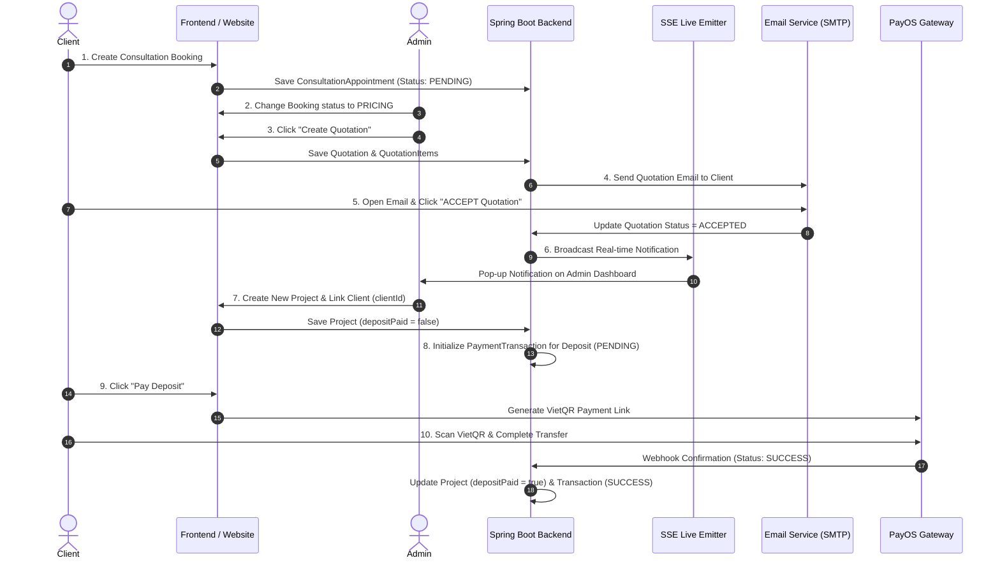

# 🚀 NovaDigital CMS & Project Management System

A premium, enterprise-grade Content Management & Project Coordination System (CMS) designed by **NovaDigital**, optimized for project milestone tracking, real-time quotation & booking management, PayOS payment integration, team resource allocation, and client collaboration.

---

## 🔄 End-to-End Core Workflow



---

## 📑 Table of Contents
- [🔄 End-to-End Core Workflow](#-end-to-end-core-workflow)
- [⚡ Key Features](#-key-features)
  - [1. Authentication & Role-Based Access (RBAC)](#1-authentication--role-based-access-rbac)
  - [2. Quotation & Real-Time Booking System](#2-quotation--real-time-booking-system)
  - [3. PayOS Payment Gateway Integration](#3-payos-payment-gateway-integration)
  - [4. Project Management & Resource Allocation](#4-project-management--resource-allocation)
  - [5. Administrator Console & Analytics (`admin.html`)](#5-administrator-console--analytics-adminhtml)
  - [6. Audit Data Change Logs (Mutation Audit Trail)](#6-audit-data-change-logs-mutation-audit-trail)
  - [7. Member & Client Portals](#7-member--client-portals)
  - [8. Real-Time Live Sync (Server-Sent Events)](#8-real-time-live-sync-server-sent-events)
  - [9. Careers & Public Portals](#9-careers--public-portals)
- [🛠️ Tech Stack](#️-tech-stack)
- [🚀 Setup & Installation](#-setup--installation)
- [📡 API Endpoints Overview](#-api-endpoints-overview)
- [📁 Key Project Structure](#-key-project-structure)

---

## ⚡ Key Features

### 1. Authentication & Role-Based Access (RBAC)
* **JWT Stateless Authentication**: Secure token-based authentication stored in `LocalStorage`.
* **Google OAuth2 Integration**: Instant single sign-on (SSO) using Google ID tokens verified via `GoogleTokenVerifierService`.
* **Role-Based Access Control (RBAC)**:
  * `ROLE_ADMIN`: Complete system oversight (manage projects, members, services, quotations, payments, audit logs).
  * `ROLE_MEMBER`: Internal agency team members (assigned as Project Managers or Staff).
  * `ROLE_USER`: External clients requesting services, managing hired projects, and completing payments.
* **Password Reset & OTP Verification**: Password recovery with OTP confirmation codes delivered via SMTP Email.
* **Security & Anti-Spam**: Login-attempt Captcha verification, anti-spam validation, and auto-complete protection.

### 2. Quotation & Real-Time Booking System
* **Consultation Booking Workflow**: Clients can book consultation appointments, choose services, and select add-on options (`ConsultationAppointment`).
* **Quotation Management (`Quotation System`)**:
  * Admins can change status to `PRICING`, build, adjust, and send itemized quotations (`QuotationItem`) tied directly to client bookings.
  * Complete quotation lifecycle management: `PENDING` ➔ `PRICING` ➔ `ACCEPTED` / `REJECTED`.
* **Automated Email Notifications**: Automatically dispatches confirmation emails and formatted quotation breakdown documents to client email addresses via `EmailService`.
* **Real-Time Booking & Quotation Stream**: Leverages `SseEmitterService` to send instant pop-up notifications to Admin whenever a client accepts a quotation or submits a new booking.

### 3. PayOS Payment Gateway Integration
* **Automated VietQR Payments**: Native integration with the official PayOS SDK (`vn.payos.PayOS`) to generate dynamic VietQR payment links (`CreatePaymentLinkRequest`).
* **Initial Project Deposit Payments**:
  * **Project Initial Deposit**: Created simultaneously when Admin initializes a Project after receiving quotation acceptance notification.
  * **Transaction Lifecycle**: Triggering `/api/payments/create-deposit-payment-link` creates a `PENDING` transaction (`PaymentTransaction`) and generates a VietQR link.
* **Milestone Progress Payments**: Milestone-based progress payments (`milestoneId`) for completed project phases.
* **Real-Time Webhook Listener**: Listens to PayOS balance-change webhooks to automatically verify payments, update transaction records (`PaymentTransaction`), set `depositPaid = true`, and switch appointment/milestone statuses to `PAID` or `CONFIRMED`.
* **Transaction History & Alerts**: Keeps a detailed audit trail of all transactions and sends automated in-app notifications (`Notification`).

### 4. Project Management & Resource Allocation
* **Project-Client Linkage**: Connect external client accounts (`ROLE_USER`) to their respective software projects.
* **Strict Business Constraints**:
  * Enforces **maximum 1 Project Manager (PM)** per project with null-safety checks.
* **Resource Allocation Console (`resource-allocation.html`)**:
  * Visualizes team member workload, percentage allocations (%), start/end dates, and stats grid layout.
  * Full PM controls for milestone creation, progress slider adjustments (0–100%), and status transitions (`PENDING`, `IN_PROGRESS`, `COMPLETED`, `BLOCKED`).

### 5. Administrator Console & Analytics (`admin.html`)
* **Interactive Analytics**: Embedded **Chart.js** revenue analytics chart for visual business reporting.
* **Modern UI & Controls**: Sidebar collapse toggle, top navigation actions, and redesigned pop-up modals (*Booking Details*, *Message Reply*, *Audit Details*).
* **Messages Center**: Consolidated support inbox for receiving and replying to client inquiries.
* **Services & Add-ons CRUD**: Compact management console for base prices and add-on pricing modifiers (`ServiceAddon`).

### 6. Audit Data Change Logs (Mutation Audit Trail)
* **Dual Audit Dashboard**: Dedicated tabs for **Data Change Logs (Mutation Audit)** vs **Auth Logs**.
* **JSON Diff & Old vs New Visualization**: Pop-up modal displaying side-by-side comparisons of historical data states (*Old Value ➔ New Value*), timestamps, and acting user IDs.
* **Color-Coded Badges**: Instant visual identification for `CREATE` (Green), `UPDATE` (Blue), and `DELETE` (Red) operations.

### 7. Member & Client Portals
* **Member Dashboard (`member-contact.html`, `member-profile.html`)**:
  * Clear separation between "Projects I Manage as PM" (full edit access) and "Projects Assigned as Staff" (read-only monitoring).
  * Milestone progress controls and client message resolution panel.
* **Client Dashboard (`rented-project.html`, `client-dashboard.html`, `user-profile.html`)**:
  * Monitor project progress, inspect milestone timelines, view change histories, and trigger deposit payments.

### 8. Real-Time Live Sync (Server-Sent Events)
* Live **SSE Broadcast Service** pushes real-time milestone changes, quotation approvals, and booking status updates to active Member and Client dashboards without requiring manual page reloads.

### 9. Careers & Public Portals
* **Careers Page (`careers.html`)**: Public recruitment portal with job filtering, application submission modal, and full-view hero slideshow banner (`object-fit: contain`).

---

## 🛠️ Tech Stack

### Backend
* **Language & Framework**: Java 17, Spring Boot 4.1.0
* **Security & Auth**: Spring Security (Stateless JWT Filter), Google Token Verifier API
* **Database & ORM**: MySQL Database via `mysql-connector-j 9.7.0`, Spring Data JPA (Hibernate 7.4.1)
* **Payment Gateway**: PayOS Java SDK (`vn.payos:payos-java:1.0.0`)
* **Mailing**: Spring Boot Starter Mail (SMTP)
* **Real-time Sync**: Spring Web SSE (`SseEmitter`)

### Frontend
* **Core**: HTML5, Vanilla CSS3, Vanilla JavaScript (ES6+)
* **Aesthetics**: Glassmorphism dark/light theme, Outfit & Inter Google Fonts
* **Charts & Media**: Chart.js 4.4.x, full-view image sliders
* **Live Updates**: EventSource SSE API

---

## 🚀 Setup & Installation

### 1. Database Configuration
1. Install and start MySQL Server (v8.0+).
2. Create a new database named `novadigitalusers`:
   ```sql
   CREATE DATABASE novadigitalusers CHARACTER SET utf8mb4 COLLATE utf8mb4_unicode_ci;
   ```
3. Update database & API credentials in `src/main/resources/application.properties`:
   ```properties
   # Database Credentials
   spring.datasource.url=jdbc:mysql://localhost:3306/novadigitalusers?allowPublicKeyRetrieval=true&useSSL=false
   spring.datasource.username=YOUR_MYSQL_USERNAME
   spring.datasource.password=YOUR_MYSQL_PASSWORD

   # PayOS Gateway Keys
   payos.client-id=YOUR_PAYOS_CLIENT_ID
   payos.api-key=YOUR_PAYOS_API_KEY
   payos.checksum-key=YOUR_PAYOS_CHECKSUM_KEY

   # SMTP Mail Server
   spring.mail.host=smtp.gmail.com
   spring.mail.port=587
   spring.mail.username=YOUR_EMAIL
   spring.mail.password=YOUR_APP_PASSWORD
   ```

### 2. Run the Application
Compile and launch using the provided Maven Wrapper:

* **Windows (PowerShell / CMD)**:
  ```powershell
  .\mvnw.cmd spring-boot:run
  ```
* **Linux / macOS**:
  ```bash
  chmod +x mvnw
  ./mvnw spring-boot:run
  ```

Access the application in your browser at: `http://localhost:8080`

### 3. Default Test Credentials
The system automatically seeds initial demo data when starting on an empty database:

| Role | Username / Email | Password | Access / Scope |
|---|---|---|---|
| **Administrator** | `admin` (`admin@novadigital.com`) | `admin123` | Full Admin Console (`/admin.html`) |
| **Member (PM / Staff)** | `mem1` (`annguyen3@novadigital.com`) | `123456` | Member Portal & Milestones (`/member-contact.html`) |
| **Client (User)** | `user` (`user@novadigital.com`) | `123456` | Client Portal & Payments (`/rented-project.html`) |

---

## 📡 API Endpoints Overview

| Module | Method | Endpoint | Description |
|---|---|---|---|
| **Auth** | `POST` | `/api/auth/login` | Login with username/password & return JWT |
| **Auth** | `POST` | `/api/auth/google` | SSO Login via Google ID token |
| **Quotations** | `POST` | `/api/quotations` | Create a new quotation for a booking |
| **Quotations** | `PUT` | `/api/quotations/{id}/status` | Update quotation status (`ACCEPTED`/`REJECTED`) |
| **Payments** | `POST` | `/api/payments/create-deposit-payment-link` | Generate VietQR payment link for project deposit |
| **Payments** | `POST` | `/api/payments/create-milestone-payment-link` | Generate VietQR payment link for milestone phase |
| **Payments** | `POST` | `/api/payments/payos-webhook` | Receive PayOS payment confirmation webhook |
| **Projects** | `GET` | `/api/projects/{id}/assignments` | List all assigned members on a project |
| **Assignments** | `POST` | `/api/projects/{id}/assignments` | Assign member as PM or STAFF (Max 1 PM) |
| **Allocations**| `GET` | `/api/resource-allocations/project/{id}` | Get resource allocations for a project |
| **Audit Logs** | `GET` | `/api/audit-logs` | Fetch system mutation and auth audit logs |
| **SSE Stream** | `GET` | `/api/sse/subscribe` | Subscribe to live SSE event notifications |

---

## 📁 Key Project Structure

```text
NovaDigital_CMS_Workspace/
├── pom.xml                                  # Project Maven dependencies (Spring Boot, PayOS, MySQL)
├── src/main/java/com/example/demo/
│   ├── config/                              # SecurityConfig, JwtTokenProvider, DataSeeder, CorsConfig
│   ├── controller/                          # REST Controllers (Auth, Booking, Quotation, Payment, Project...)
│   ├── dto/                                 # Data Transfer Objects (QuotationRequest, PaymentLinkRequest...)
│   ├── entity/                              # JPA Entities (User, Project, Quotation, PaymentTransaction...)
│   ├── repository/                          # Spring Data Repositories
│   └── service/                             # Business Services (EmailService, SseEmitterService, QuotationService...)
└── src/main/resources/
    ├── static/                              # Web Frontend Assets
    │   ├── admin.html                       # Administrator Dashboard & Analytics
    │   ├── careers.html                     # Careers & Recruitment Portal
    │   ├── member-contact.html              # Internal Team & PM Portal
    │   ├── rented-project.html              # Client Hired Projects & Deposit Payment View
    │   ├── css/style.css                    # Master Stylesheet (Design System & Theme Tokens)
    │   └── js/main.js                       # Frontend Core Handler & SSE Event Listeners
    └── application.properties              # Database, SMTP, PayOS & Application Configurations
```

---

## 📄 License
Designed and developed by **NovaDigital Team**. All rights reserved.
