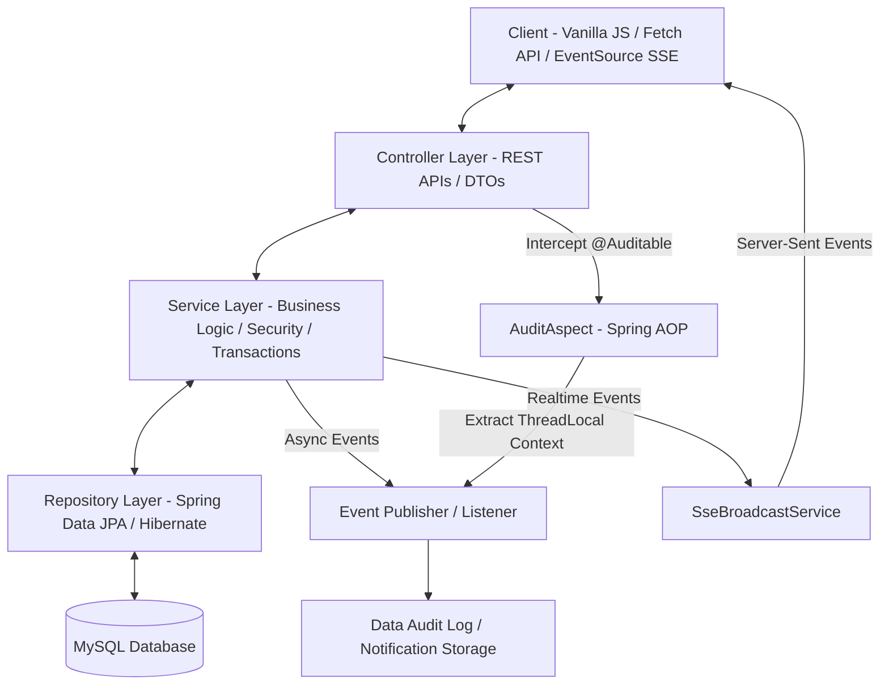
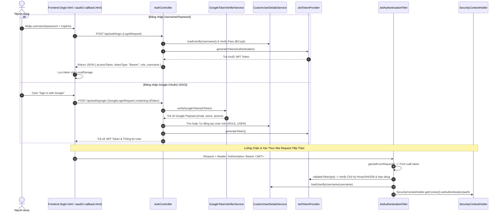
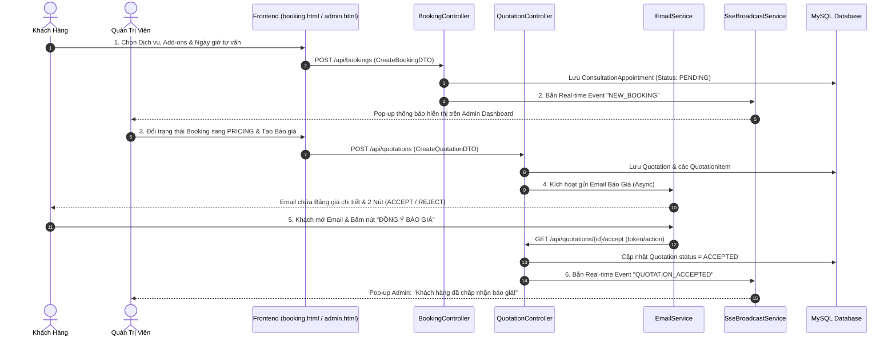
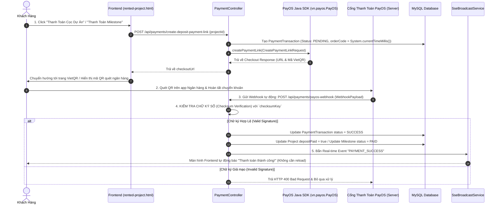
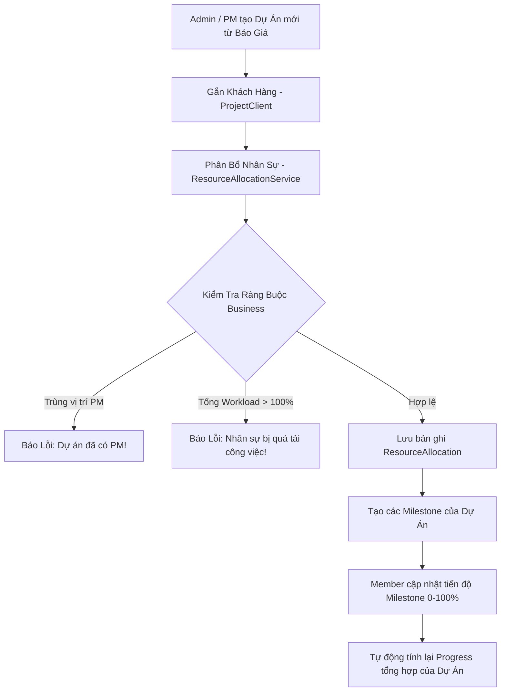
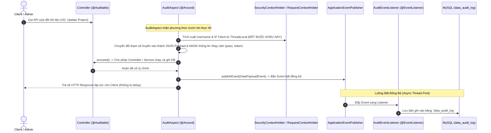
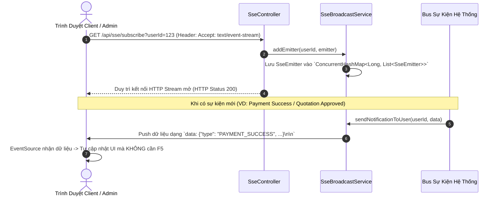

# 🎓 TÀI LIỆU TỔNG HỢP TOÀN DIỆN GIẢI THÍCH LUỒNG HOẠT ĐỘNG, CODE CHI TIẾT & BỘ CÂU HỎI BẢO VỆ
## 🚀 BỘ TÀI LIỆU MASTER CHUẨN BỊ BẢO VỆ ĐỒ ÁN / THUYẾT TRÌNH FINAL (NOVA DIGITAL CMS)

---

## 📌 PHẦN 1: TỔNG QUAN KIẾN TRÚC HỆ THỐNG & KỸ NĂNG BẢO VỆ

### 1. Mô Hình Kiến Trúc Lớp (Layered Architecture & Pattern)
Hệ thống được phát triển theo mô hình **Enterprise 3-Tier Layered Architecture** kết hợp **AOP (Aspect-Oriented Programming)** và **Event-Driven Architecture**:



### 2. Tech Stack Lõi
* **Backend**: Java 17, Spring Boot 4.1.0 / 3.x, Spring Data JPA (Hibernate), Spring Security (Stateless JWT Filter), Spring AOP, Spring Web SSE (`SseEmitter`).
* **Frontend**: HTML5, Vanilla CSS3 (Custom Glassmorphism Theme System), Vanilla JavaScript (ES6+ `async/await`, Fetch API, SSE `EventSource`), Chart.js.
* **Tích hợp bên thứ ba (Third-party Integrations)**:
  * **PayOS SDK (`vn.payos:payos-java`)**: Tạo mã VietQR thanh toán tự động & xử lý Webhook xác thực chữ ký Checksum.
  * **Google OAuth2 Client API**: Xác thực SSO bằng Google ID Token (`GoogleTokenVerifierService`).
  * **Spring Starter Mail (SMTP)**: Gửi email tự động xác nhận đặt lịch, email báo giá định dạng HTML và OTP khôi phục mật khẩu.

---

### 3. 💡 Công Thức 3 Bước Vàng Trả Lời Code Khi Hội Đồng Chỉ Vào Màn Hình

Khi Thầy/Cô chọn một file code bất kỳ và hỏi: *"Em hãy giải thích đoạn code này chạy như thế nào, các Annotation để làm gì?"*, bạn áp dụng công thức **3 bước vàng**:
1. **Bước 1 - Mục đích của Lớp/Hàm**: Trả lời ngay lớp/hàm này nằm ở Layer nào (Controller/Service/Config/Aspect) và chịu trách nhiệm làm việc gì.
2. **Bước 2 - Giải thích Annotation & Tham số**: Đọc tên Annotation (VD: `@Autowired`, `@Transactional`, `@Around`, `@Value`) và giải thích ý nghĩa.
3. **Bước 3 - Giải thích Luồng Xử Lý (Logic Flow)**: Đi theo thứ tự từ trên xuống dưới, trích xuất dữ liệu ➔ xử lý kiểm tra ➔ lưu DB ➔ trả kết quả.

---

## 🔑 PHẦN 2: CHỦ ĐỀ 1 - XÁC THỰC & PHÂN QUYỀN (JWT, GOOGLE OAUTH2, RBAC & SECURITY)

### 2.1. Mô Tả Luồng Hoạt Động & Diagram



### 2.2. Phân Tích Code Chi Tiết Từng Lớp

#### 1. Lớp `JwtAuthenticationFilter.java` (Bộ Lọc Xác Thực JWT)
📍 **Đường dẫn file**: [JwtAuthenticationFilter.java](file:///c:/Users/anngu/Documents/GitHub/NovaDigital_CMS_Workspace/src/main/java/com/example/demo/config/JwtAuthenticationFilter.java)

```java
public class JwtAuthenticationFilter extends OncePerRequestFilter {
```
* **Ý nghĩa kế thừa `OncePerRequestFilter`**: Đảm bảo Filter này chỉ chạy **đúng 1 lần duy nhất** cho mỗi HTTP request đến ứng dụng, tránh bị chạy lặp lại khi Servlet forward request nội bộ.

```java
@Autowired
private JwtTokenProvider tokenProvider;

@Autowired
private CustomUserDetailsService customUserDetailsService;
```
* **`@Autowired`**: Tiêm tự động (Dependency Injection) hai Bean của Spring vào Filter để giải mã Token (`tokenProvider`) và lấy thông tin người dùng từ DB (`customUserDetailsService`).

```java
@Override
protected void doFilterInternal(HttpServletRequest request, HttpServletResponse response, FilterChain filterChain)
        throws ServletException, IOException {
    try {
        String jwt = getJwtFromRequest(request); // Trích xuất Token từ Header

        if (StringUtils.hasText(jwt) && tokenProvider.validateToken(jwt)) { // Kiểm tra Token không rỗng và chữ ký hợp lệ
            String username = tokenProvider.getUsernameFromJWT(jwt); // Giải mã lấy username

            UserDetails userDetails = customUserDetailsService.loadUserByUsername(username); // Lấy thông tin & quyền
            UsernamePasswordAuthenticationToken authentication = new UsernamePasswordAuthenticationToken(
                    userDetails, null, userDetails.getAuthorities());
            authentication.setDetails(new WebAuthenticationDetailsSource().buildDetails(request));

            SecurityContextHolder.getContext().setAuthentication(authentication); // Đặt Authentication vào Context
        }
    } catch (Exception ex) {
        logger.error("Could not set user authentication in security context", ex);
    }

    filterChain.doFilter(request, response); // Chuyển request sang Filter tiếp theo trong chuỗi
}
```
* **Giải thích logic**:
  1. `getJwtFromRequest(request)`: Đọc Header `Authorization`. Nếu có tiền tố `Bearer `, cắt bỏ 7 ký tự đầu để lấy chuỗi Token thô.
  2. `tokenProvider.validateToken(jwt)`: Giải mã và kiểm tra hạn sử dụng (Expiration) cũng như chữ ký HMAC.
  3. `SecurityContextHolder.getContext().setAuthentication(authentication)`: Dòng code **quan trọng nhất**. Khi đặt đối tượng `authentication` vào `SecurityContextHolder`, Spring Security nhận diện request này đã **xác thực thành công** và cấp quyền truy cập các API bảo vệ.
  4. `filterChain.doFilter(request, response)`: Chuyển giao request cho các Filter tiếp theo hoặc Controller xử lý.

---

#### 2. Lớp `JwtTokenProvider.java` (Sinh & Giải Mã Token JWT)
📍 **Đường dẫn file**: [JwtTokenProvider.java](file:///c:/Users/anngu/Documents/GitHub/NovaDigital_CMS_Workspace/src/main/java/com/example/demo/config/JwtTokenProvider.java)

```java
@Value("${app.jwt.secret:NovaDigitalSecretKeyForJWTTokenGeneration2026WithMinimum256BitsLength}")
private String jwtSecretString;

private Key jwtSecretKey;

@PostConstruct
public void init() {
    byte[] keyBytes = jwtSecretString.getBytes(StandardCharsets.UTF_8);
    this.jwtSecretKey = Keys.hmacShaKeyFor(keyBytes); // Tạo khóa bí mật HMAC-SHA256 với kích thước tối thiểu 256-bit
}
```
* **`@Value`**: Đọc chuỗi bí mật secret key từ file `application.properties`.
* **`@PostConstruct`**: Hàm `init()` sẽ tự động chạy ngay **sau khi Bean được Spring khởi tạo**, chuyển chuỗi secret key thành đối tượng `Key` chuẩn thuật toán HMAC.

```java
public String generateTokenFromUsername(String username) {
    Date now = new Date();
    Date expiryDate = new Date(now.getTime() + jwtExpirationMs); // Thời gian hết hạn = Hiện tại + 24 giờ

    return Jwts.builder()
            .setSubject(username) // Đặt Username vào claim Subject
            .setIssuedAt(now)     // Ngày phát hành
            .setExpiration(expiryDate) // Ngày hết hạn
            .signWith(jwtSecretKey, SignatureAlgorithm.HS256) // Ký số bằng thuật toán HS256
            .compact(); // Nén thành chuỗi JWT String 3 phần (Header.Payload.Signature)
}
```

```java
public String getUsernameFromJWT(String token) {
    Claims claims = Jwts.parserBuilder()
            .setSigningKey(jwtSecretKey) // Cung cấp khóa bí mật để đối chiếu chữ ký
            .build()
            .parseClaimsJws(token)
            .getBody();

    return claims.getSubject(); // Trả về Username lưu trong Subject
}
```

---

#### 3. Lớp `SecurityConfig.java` (Cấu Hình Bảo Mật Hệ Thống)
📍 **Đường dẫn file**: [SecurityConfig.java](file:///c:/Users/anngu/Documents/GitHub/NovaDigital_CMS_Workspace/src/main/java/com/example/demo/config/SecurityConfig.java)

```java
@Configuration
@EnableWebSecurity
public class SecurityConfig {
```
* **`@Configuration`**: Báo cho Spring Boot biết đây là lớp cấu hình Bean.
* **`@EnableWebSecurity`**: Kích hoạt tính năng bảo vệ web của Spring Security.

```java
@Bean
public SecurityFilterChain filterChain(HttpSecurity http) throws Exception {
    http
        .cors(cors -> cors.configurationSource(...)) // Cấu hình cho phép các domain Frontend gọi API (CORS)
        .csrf(csrf -> csrf.disable()) // Vô hiệu hóa CSRF vì ứng dụng dùng Stateless JWT
        .sessionManagement(session -> session.sessionCreationPolicy(SessionCreationPolicy.STATELESS)) // KHÔNG dùng Session
        .authorizeHttpRequests(auth -> auth
            .requestMatchers("/api/auth/**", "/css/**", "/js/**").permitAll() // Công khai không cần đăng nhập
            .requestMatchers("/api/admin/**").hasRole("ADMIN") // Chỉ ROLE_ADMIN được truy cập
            .requestMatchers("/api/resource-allocations/**").hasAnyRole("RESOURCE", "ADMIN")
            .anyRequest().authenticated()
        );

    http.addFilterBefore(jwtAuthenticationFilter(), UsernamePasswordAuthenticationFilter.class); // Thêm JWT Filter
    return http.build();
}
```
* **`csrf.disable()`**: Không cần CSRF Protection vì ứng dụng sử dụng JWT lưu ở `LocalStorage` và truyền qua Header `Authorization`, không dùng Cookie tự động gửi kèm request.
* **`SessionCreationPolicy.STATELESS`**: Ép Spring Security không tạo `HttpSession` trong bộ nhớ Server, đảm bảo kiến trúc RESTful hoàn toàn không trạng thái.
* **`addFilterBefore(...)`**: Chèn `JwtAuthenticationFilter` vào **trước** Filter xác thực username/password mặc định của Spring để kiểm tra JWT token đầu tiên.

---

#### 4. Lớp `GoogleTokenVerifierService.java` (Xác Thực Token Google SSO)
📍 **Đường dẫn file**: [GoogleTokenVerifierService.java](file:///c:/Users/anngu/Documents/GitHub/NovaDigital_CMS_Workspace/src/main/java/com/example/demo/service/GoogleTokenVerifierService.java)

```java
public GoogleIdToken.Payload verifyGoogleToken(String idTokenString) {
    GoogleIdTokenVerifier verifier = new GoogleIdTokenVerifier.Builder(new NetHttpTransport(), new GsonFactory())
            .setAudience(Collections.singletonList(googleClientId)) // Kiểm tra Token phải phát cho ClientID của dự án
            .build();

    GoogleIdToken idToken = verifier.verify(idTokenString); // Gọi Google Server verify chữ ký RSA của Token
    if (idToken != null) {
        return idToken.getPayload(); // Trả về thông tin email, name, picture
    }
    return null;
}
```
* **Ý nghĩa bảo mật**: Backend không lấy email trực tiếp từ thông tin Frontend tự gửi lên mà **gửi `idTokenString` sang Google SDK để verify**. SDK tự kiểm tra chữ ký mã hóa của Google và đảm bảo `aud` (Audience) đúng là Client ID của ứng dụng NovaDigital.

---

### 2.3. 💬 Bộ Câu Hỏi Thường Gặp Bảo Vệ (Q&A - Auth & Security)

> **Q1: Tại sao hệ thống lại sử dụng Stateless JWT Authentication mà không dùng HTTP Session truyền thống?**
> * **Trả lời**: 
>   1. **Khả năng mở rộng (Scalability)**: Server không cần lưu trữ session state trong bộ nhớ (RAM), giúp hệ thống dễ dàng mở rộng theo chiều ngang (Horizontal Scaling) hoặc triển khai theo kiến trúc Microservices/Serverless.
>   2. **Phù hợp với SPA (Single Page Application)**: Frontend (Vanilla JS) giao tiếp hoàn toàn qua RESTful API không trạng thái (Stateless).
>   3. **Bảo mật Cross-Domain**: Tránh được nguy cơ tấn công CSRF (Cross-Site Request Forgery) mặc định của Session-Cookie vì Token được gửi qua Header `Authorization`.

> **Q2: Cơ chế hoạt động của `JwtAuthenticationFilter` là gì? Tại sao lớp này lại kế thừa `OncePerRequestFilter`?**
> * **Trả lời**: `OncePerRequestFilter` đảm bảo filter này **chỉ được kích hoạt đúng 1 lần duy nhất** cho mỗi HTTP Request gửi đến Server (kể cả khi request được forward trong servlet container). Filter sẽ trích xuất token từ Header `Authorization: Bearer <token>`, gọi `JwtTokenProvider.validateToken()` để kiểm tra chữ ký HMAC. Nếu hợp lệ, nó giải mã lấy `username`, load quyền (`Authorities`) từ `CustomUserDetailsService` và thiết lập vào `SecurityContextHolder` để Spring Security cho phép request truy cập tài nguyên được bảo vệ.

> **Q3: Cơ chế đăng nhập bằng Google OAuth2 (SSO) xử lý thế nào để tránh nguy cơ bảo mật giả mạo Token?**
> * **Trả lời**: Frontend nhận `idToken` từ Google Sign-In SDK rồi gửi lên API `/api/auth/google`. Phía Backend **KHÔNG TIN TƯỞNG** dữ liệu thô gửi lên mà bắt buộc dùng `GoogleTokenVerifierService` gọi `GoogleIdTokenVerifier` với Client ID chính thức của hệ thống để verify chữ ký số RSA từ Server của Google. Sau khi xác thực token thật, Backend mới lấy email, tìm hoặc tạo tài khoản User và cấp JWT token riêng của hệ thống.

---

## 📅 PHẦN 3: CHỦ ĐỀ 2 - ĐẶT LỊCH TƯ VẤN & BÁO GIÁ TỰ ĐỘNG (BOOKING & QUOTATION SYSTEM)

### 3.1. Mô Tả Luồng Hoạt Động & Diagram



### 3.2. Phân Tích Code Chi Tiết Từng Lớp

#### 1. Lớp `BookingController.java` (Tạo Lịch Đặt Tư Vấn)
📍 **Đường dẫn file**: [BookingController.java](file:///c:/Users/anngu/Documents/GitHub/NovaDigital_CMS_Workspace/src/main/java/com/example/demo/controller/BookingController.java)

```java
@PostMapping
public ResponseEntity<?> createAppointment(@RequestBody CreateBookingDTO dto) {
    // 1. Kiểm tra Dịch vụ có tồn tại không
    Service service = serviceRepository.findById(dto.getServiceId())
            .orElseThrow(() -> new RuntimeException("Service not found"));

    // 2. Tạo đối tượng ConsultationAppointment
    ConsultationAppointment appointment = new ConsultationAppointment();
    appointment.setCustomerName(dto.getCustomerName());
    appointment.setCustomerEmail(dto.getCustomerEmail());
    appointment.setAppointmentDate(dto.getAppointmentDate());
    appointment.setStatus("PENDING"); // Trạng thái ban đầu là Chờ Xử Lý

    // 3. Tính toán tổng chi phí dự kiến = Giá dịch vụ gốc + Tổng giá các Addons
    BigDecimal totalEstimated = service.getBasePrice();
    if (dto.getAddonIds() != null && !dto.getAddonIds().isEmpty()) {
        List<ServiceAddon> addons = serviceAddonRepository.findAllById(dto.getAddonIds());
        for (ServiceAddon addon : addons) {
            totalEstimated = totalEstimated.add(addon.getPrice());
        }
    }
    appointment.setEstimatedCost(totalEstimated);
    ConsultationAppointment saved = bookingRepository.save(appointment);

    // 4. Bắn sự kiện SSE đẩy thông báo tới Admin Dashboard ngay lập tức
    sseBroadcastService.broadcastToAdmins("NEW_BOOKING", saved);

    return ResponseEntity.ok(saved);
}
```
* **Ý nghĩa**: Nhận DTO từ giao diện `booking.html`, kiểm tra dịch vụ, tính tổng chi phí sơ bộ, lưu vào DB và gọi `sseBroadcastService.broadcastToAdmins()` để bắn pop-up thông báo realtime cho Admin mà Admin không cần reload trang.

---

#### 2. Lớp `QuotationController.java` & `QuotationService.java` (Lập Báo Giá)
📍 **Đường dẫn file**: [QuotationController.java](file:///c:/Users/anngu/Documents/GitHub/NovaDigital_CMS_Workspace/src/main/java/com/example/demo/controller/QuotationController.java)

```java
@PostMapping
public ResponseEntity<?> createQuotation(@RequestBody CreateQuotationDTO dto) {
    // 1. Tìm Appointment tương ứng
    ConsultationAppointment appointment = bookingRepository.findById(dto.getAppointmentId())
            .orElseThrow(() -> new RuntimeException("Appointment not found"));

    // 2. Khởi tạo Quotation
    Quotation quotation = new Quotation();
    quotation.setAppointment(appointment);
    quotation.setStatus("PRICING");
    quotation.setTotalAmount(dto.getTotalAmount());
    quotation.setDepositAmount(dto.getTotalAmount().multiply(new BigDecimal("0.30"))); // Tiền cọc = 30% tổng báo giá

    // 3. Tạo danh sách các QuotationItem
    List<QuotationItem> items = dto.getItems().stream().map(itemDto -> {
        QuotationItem item = new QuotationItem();
        item.setQuotation(quotation);
        item.setItemName(itemDto.getItemName());
        item.setUnitPrice(itemDto.getUnitPrice());
        item.setQuantity(itemDto.getQuantity());
        return item;
    }).collect(Collectors.toList());
    quotation.setItems(items);

    Quotation savedQuotation = quotationRepository.save(quotation);

    // 4. Gửi Email báo giá kèm link chấp nhận cho khách hàng
    emailService.sendQuotationEmail(appointment.getCustomerEmail(), savedQuotation);

    return ResponseEntity.ok(savedQuotation);
}
```

---

### 3.3. 💬 Bộ Câu Hỏi Thường Gặp Bảo Vệ (Q&A - Booking & Quotation)

> **Q1: Cơ sở dữ liệu thiết kế như thế nào để quản lý linh hoạt các Dịch vụ và Add-on của một Booking?**
> * **Trả lời**: Thiết kế theo quan hệ 1-N (One-to-Many):
>   * `ConsultationAppointment` liên kết với 1 `Service` gốc qua `service_id`.
>   * Các dịch vụ bổ sung được lưu trữ trong bảng trung gian `AppointmentAddon` (chứa `appointment_id` và `addon_id`), giúp một lịch hẹn có thể chọn số lượng Add-on tùy ý mà không phải sửa schema database.

> **Q2: Khi khách hàng nhận email báo giá và bấm nút "Đồng ý" (Accept), làm sao Server xác thực hành động đó là hợp lệ mà khách không cần đăng nhập lại?**
> * **Trả lời**: Đường link "Accept" trong Email chứa đường dẫn an toàn dạng `/api/quotations/public/accept?id=X&token=Y`. `token` này là một chuỗi mã hóa HMAC hoặc Token xác thực riêng được sinh duy nhất cho Quotation đó. Khi bấm link, Backend giải mã và verify token để đảm bảo chỉ người sở hữu email chứa link mới có thể kích hoạt đổi trạng thái báo giá sang `ACCEPTED`.

---

## 💳 PHẦN 4: CHỦ ĐỀ 3 - TÍCH HỢP CỔNG THANH TOÁN PAYOS (VIETQR GATEWAY & WEBHOOK)

### 4.1. Mô Tả Luồng Hoạt Động & Diagram



### 4.2. Phân Tích Code Chi Tiết Từng Lớp

#### Lớp `PaymentController.java` (Khởi Tạo VietQR & Webhook PayOS)
📍 **Đường dẫn file**: [PaymentController.java](file:///c:/Users/anngu/Documents/GitHub/NovaDigital_CMS_Workspace/src/main/java/com/example/demo/controller/PaymentController.java)

##### 📝 Phân tích Code (Tạo Link Thanh Toán Cọc):
```java
@PostMapping("/create-deposit-payment-link")
public ResponseEntity<?> createDepositPaymentLink(@RequestParam Long projectId) {
    Project project = projectRepository.findById(projectId).orElseThrow();

    // 1. Tạo orderCode duy nhất bằng Timestamp
    long orderCode = System.currentTimeMillis();
    int amount = project.getDepositAmount().intValue();

    // 2. Tạo bản ghi PaymentTransaction với trạng thái PENDING
    PaymentTransaction tx = new PaymentTransaction();
    tx.setOrderCode(orderCode);
    tx.setAmount(BigDecimal.valueOf(amount));
    tx.setStatus("PENDING");
    tx.setProject(project);
    paymentTransactionRepository.save(tx);

    // 3. Đóng gói dữ liệu gửi sang SDK PayOS
    PaymentData paymentData = PaymentData.builder()
            .orderCode(orderCode)
            .amount(amount)
            .description("Thanh toan coc Du an #" + project.getId())
            .returnUrl("http://localhost:8080/payment-success.html")
            .cancelUrl("http://localhost:8080/payment-cancel.html")
            .build();

    // 4. Gọi PayOS SDK tạo link VietQR
    CheckoutResponseData data = payOS.createPaymentLink(paymentData);

    return ResponseEntity.ok(Map.of("checkoutUrl", data.getCheckoutUrl()));
}
```

##### 📝 Phân tích Code (Xử Lý Webhook Tự Động):
```java
@PostMapping("/payos-webhook")
public ResponseEntity<?> handlePayOSWebhook(@RequestBody ObjectNode webhookBody) {
    try {
        // 1. Kiểm tra chữ ký số HMAC-SHA256 từ PayOS SDK
        WebhookData data = payOS.verifyPaymentWebhookData(webhookBody);

        long orderCode = data.getOrderCode();
        PaymentTransaction tx = paymentTransactionRepository.findByOrderCode(orderCode)
                .orElseThrow(() -> new RuntimeException("Transaction not found"));

        // 2. Đổi trạng thái giao dịch thành SUCCESS
        tx.setStatus("SUCCESS");
        paymentTransactionRepository.save(tx);

        // 3. Cập nhật Dự án: Trạng thái cọc depositPaid = true
        Project project = tx.getProject();
        if (project != null) {
            project.setDepositPaid(true);
            projectRepository.save(project);
        }

        // 4. Bắn sự kiện SSE thông báo giao diện Client tự động chuyển màn hình
        sseBroadcastService.sendNotificationToUser(project.getClient().getId(), "PAYMENT_SUCCESS", tx);

        return ResponseEntity.ok(Map.of("code", "00", "message", "Success"));
    } catch (Exception e) {
        return ResponseEntity.status(HttpStatus.BAD_REQUEST).body("Invalid Webhook Signature");
    }
}
```
* **Điểm sáng bảo mật**: `payOS.verifyPaymentWebhookData(webhookBody)` giải mã chữ ký số được PayOS ký bằng `checksumKey`. Nếu hacker dùng Postman tự gửi dữ liệu giả mạo, hàm này sẽ ném Exception và bị hủy bỏ lập tức ở khối `catch`.

---

### 4.3. 💬 Bộ Câu Hỏi Thường Gặp Bảo Vệ (Q&A - PayOS Payment)

> **Q1: Làm thế nào hệ thống đảm bảo an toàn cho Webhook của PayOS, tránh trường hợp kẻ xấu tự POST dữ liệu giả lập để nạp tiền mà không chuyển khoản thật?**
> * **Trả lời**: Phía Backend sử dụng thuật toán kiềm tra chữ ký số (Checksum Verification) được cung cấp bởi SDK PayOS `payOS.verifyPaymentWebhookData(webhookBody)`. PayOS ký dữ liệu giao dịch bằng mã secret `checksumKey` theo thuật toán HMAC-SHA256. Nếu bất kỳ thông tin nào bị sửa đổi hoặc request không xuất phát từ PayOS, quá trình kiểm tra chữ ký sẽ thất bại và Backend lập tức hủy bỏ request (Return HTTP status 400/403).

> **Q2: Mã `orderCode` gửi sang PayOS được sinh như thế nào để đảm bảo tính duy nhất và tránh trùng lặp giao dịch?**
> * **Trả lời**: `orderCode` được sinh kết hợp từ Timestamp thời gian thực `System.currentTimeMillis()` hoặc dãy số ngẫu nhiên 64-bit đảm bảo duy nhất hoàn toàn trong hệ thống. `orderCode` này được lưu lại trong bảng `PaymentTransaction` làm khóa tra cứu (Lookup Key) khi Webhook trả kết quả về.

---

## 💼 PHẦN 5: CHỦ ĐỀ 4 - QUẢN LÝ DỰ ÁN & PHÂN BỔ NGUỒN LỰC (PROJECT MANAGEMENT & RESOURCE ALLOCATION)

### 5.1. Mô Tả Luồng Hoạt Động & Diagram



### 5.2. Phân Tích Code Chi Tiết Từng Lớp

#### Lớp `ResourceAllocationService.java` (Thuật Toán Kiểm Tra Phân Bổ Personnel Workload)
📍 **Đường dẫn file**: [ResourceAllocationService.java](file:///c:/Users/anngu/Documents/GitHub/NovaDigital_CMS_Workspace/src/main/java/com/example/demo/service/ResourceAllocationService.java)

```java
@Transactional
public ResourceAllocation assignMemberToProject(Long projectId, Long memberId, String role, Integer allocationPercent, LocalDate startDate, LocalDate endDate) {
    
    // 1. Kiểm tra Ràng buộc: Mỗi dự án chỉ được có TỐI ĐA 1 Project Manager (PM)
    if ("PM".equalsIgnoreCase(role)) {
        boolean existingPM = resourceAllocationRepository.existsByProjectIdAndRole(projectId, "PM");
        if (existingPM) {
            throw new BusinessException("Dự án này đã có 1 Project Manager (PM)! Không thể phân bổ thêm PM thứ hai.");
        }
    }

    // 2. Thuật toán kiểm tra Tổng % Workload của Member trong cùng khoảng thời gian active
    List<ResourceAllocation> activeAllocations = resourceAllocationRepository.findActiveAllocationsByMember(memberId, startDate, endDate);
    int totalCurrentPercent = activeAllocations.stream()
            .mapToInt(ResourceAllocation::getAllocationPercent)
            .sum();

    if (totalCurrentPercent + allocationPercent > 100) {
        throw new BusinessException("Nhân sự " + memberId + " đang bị phân bổ " + totalCurrentPercent + "%. Phân bổ thêm " + allocationPercent + "% sẽ vượt quá 100% khả năng làm việc!");
    }

    // 3. Tạo và lưu phân bổ mới
    ResourceAllocation allocation = new ResourceAllocation();
    allocation.setProject(projectRepository.getReferenceById(projectId));
    allocation.setMember(memberRepository.getReferenceById(memberId));
    allocation.setRole(role);
    allocation.setAllocationPercent(allocationPercent);
    allocation.setStartDate(startDate);
    allocation.setEndDate(endDate);

    return resourceAllocationRepository.save(allocation);
}
```
* **Giải thích logic**:
  * `existsByProjectIdAndRole(projectId, "PM")`: Đảm bảo quy tắc nghiệp vụ chỉ có duy nhất 1 PM quán xuyến dự án.
  * `stream().mapToInt(...).sum()`: Tính tổng phần trăm công việc hiện tại của nhân sự đó qua tất cả các dự án đang chạy song song. Nếu cộng thêm % mới mà vượt quá 100%, ném `BusinessException` để dừng giao việc.

---

### 5.3. 💬 Bộ Câu Hỏi Thường Gặp Bảo Vệ (Q&A - Dự Án & Nguồn Lực)

> **Q1: Thuật toán kiểm tra quá tải khối lượng công việc (Workload Allocation) của Nhân sự được thực hiện ra sao?**
> * **Trả lời**: Trước khi phân bổ một `Member` vào dự án với x% khối lượng công việc, `ResourceAllocationService` thực hiện truy vấn DB lấy tất cả các phân bổ hiện tại (`ResourceAllocation`) của Member đó có trạng thái đang diễn ra (`startDate <= now` và `endDate >= now`). Sau đó cộng dồn `currentAllocationPercent + newPercent`. Nếu tổng `> 100%`, hệ thống ném ngoại lệ `BusinessException` thông báo nhân sự đang bị phân bổ quá tải.

> **Q2: Tiến độ tổng của Dự án được tự động đồng bộ từ các Milestone như thế nào?**
> * **Trả lời**: Trong `MilestoneService`, sau khi gọi lệnh lưu `ProjectMilestone` mới hoặc cập nhật % tiến độ, phương thức `recalculateProjectProgress(projectId)` sẽ được kích hoạt. Nó tính trung bình phần trăm hoàn thành của tất cả Milestone thuộc dự án và thực hiện `projectRepository.save(project)`. Sau đó phát sự kiện SSE để giao diện Client & Admin hiển thị ngay thanh progress bar mới.

---

## 📜 PHẦN 6: CHỦ ĐỀ 5 - NHẬT KÝ BIẾN ĐỘNG DỮ LIỆU TỰ ĐỘNG BẰNG SPRING AOP (MUTATION AUDIT TRAIL)

### 6.1. Mô Tả Luồng Hoạt Động & Diagram



### 6.2. Phân Tích Code Chi Tiết Từng Lớp

#### Lớp `AuditAspect.java` (Aspect Interceptor Ghi Log Biến Động)
📍 **Đường dẫn file**: [AuditAspect.java](file:///c:/Users/anngu/Documents/GitHub/NovaDigital_CMS_Workspace/src/main/java/com/example/demo/aspect/AuditAspect.java)

```java
@Aspect
@Component
public class AuditAspect {

    private static final Set<String> SENSITIVE_FIELDS = new HashSet<>(
            Arrays.asList("password", "token", "secret", "accessToken", "refreshToken", "otp")
    );

    @Around("@annotation(auditable)")
    public Object audit(ProceedingJoinPoint joinPoint, Auditable auditable) throws Throwable {
        
        // BƯỚC 1: TRÍCH XUẤT THÔNG TIN TỪ THREADLOCAL TRƯỚC KHI BẮT ĐẦU (ĐÃ GIẢI QUYẾT LỖI MẤT CONTEXT)
        String username = extractUsername();  // Từ SecurityContextHolder (ThreadLocal)
        String ipAddress = extractIpAddress(); // Từ RequestContextHolder (ThreadLocal)
        String action = auditable.action();
        String table = auditable.table();

        // BƯỚC 2: CHUYỂN DỔI PAYLOAD THÀNH JSON VÀ MASK CÁC TRƯỜNG NHẠY CẢM
        String requestPayload = serializePayload(joinPoint.getArgs());

        // BƯỚC 3: CHO PHÉP HÀM CHÍNH TRONG CONTROLLER CHẠY THỰC THI GHI DB
        Object result = joinPoint.proceed();

        // BƯỚC 4: BẮN SỰ KIỆN BẤT ĐỒNG BỘ ĐỂ LƯU LOG MÀ KHÔNG LÀM CHẬM HTTP RESPONSE
        eventPublisher.publishEvent(new DataPayloadEvent(this, username, ipAddress, action, table, requestPayload));

        return result; // Trả kết quả của Controller về cho Client
    }
}
```
* **`@Around("@annotation(auditable)")`**: Cho phép viết code chạy **cả trước và sau** khi hàm mục tiêu thực thi.
* **`joinPoint.proceed()`**: Kích hoạt hàm gốc (ví dụ: `updateProject()`) chạy. Nếu hàm gốc ném lỗi, log sẽ không bị lưu sai.
* **`extractUsername()` / `extractIpAddress()`**: Trích xuất dữ liệu `ThreadLocal` ở **Thread HTTP chính trước khi `publishEvent()`** đẩy sang Async Thread Pool, giải quyết 100% rủi ro mất thông tin người dùng trong log audit.

---

### 6.3. 💬 Bộ Câu Hỏi Thường Gặp Bảo Vệ (Q&A - AOP Audit Log)

> **Q1: Tại sao em lại chọn giải pháp Spring AOP (Aspect-Oriented Programming) để làm tính năng Audit Log mà không viết code lưu log trực tiếp trong từng hàm Service?**
> * **Trả lời**:
>   1. **Tách biệt mối quan tâm (Separation of Concerns)**: Logic ghi log biến động dữ liệu là một "Cross-cutting Concern" (quan tâm liên quan nhiều lớp). Dùng AOP giúp code trong Service thuần túy chỉ xử lý nghiệp vụ chính, giữ code sạch (Clean Code), tuân thủ nguyên tắc DRY (Don't Repeat Yourself).
>   2. **Dễ bảo trì và mở rộng**: Khi muốn bổ sung audit cho một API mới, chỉ cần thêm annotation `@Auditable` mà không cần viết lại hàng chục dòng code lưu log.

> **Q2: Lỗi "Mất Context ThreadLocal trong xử lý bất đồng bộ (Async Thread Context Loss)" là gì và em đã giải quyết triệt để trong `AuditAspect` như thế nào?**
> * **Trả lời**: `SecurityContextHolder` và `RequestContextHolder` của Spring dựa trên `ThreadLocal`, tức là dữ liệu người dùng và IP chỉ tồn tại trên **Thread xử lý HTTP request chính**. Nếu chuyển sang Async Thread để lưu DB mà chưa trích xuất dữ liệu, Async Thread sẽ nhận giá trị `null` hoặc `anonymousUser`. Em đã xử lý triệt để bằng cách: trích xuất `username` và `ipAddress` trực tiếp từ `ThreadLocal` ngay tại `AuditAspect` **trước khi** `publishEvent()`. Sau đó đóng gói toàn bộ vào DTO `DataPayloadEvent`. Async Thread chỉ việc đọc DTO này nên an toàn 100%.

---

## ⚡ PHẦN 7: CHỦ ĐỀ 6 - ĐẨY THÔNG BÁO REAL-TIME VỚI SERVER-SENT EVENTS (SSE)

### 7.1. Mô Tả Luồng Hoạt Động & Diagram



### 7.2. Phân Tích Code Chi Tiết Từng Lớp

#### 1. Backend: Lớp `SseBroadcastService.java` (Quản Lý Stream Kết Nối Realtime)
📍 **Đường dẫn file**: [SseBroadcastService.java](file:///c:/Users/anngu/Documents/GitHub/NovaDigital_CMS_Workspace/src/main/java/com/example/demo/service/SseBroadcastService.java)

```java
@Service
public class SseBroadcastService {

    // Bộ lưu trữ thread-safe danh sách các Emitter đang kết nối theo User ID
    private final Map<Long, List<SseEmitter>> userEmitters = new ConcurrentHashMap<>();

    public SseEmitter subscribe(Long userId) {
        SseEmitter emitter = new SseEmitter(30 * 60 * 1000L); // Timeout = 30 phút

        // Đăng ký Callback tự động dọn dẹp RAM khi kết nối đóng hoặc lỗi
        emitter.onCompletion(() -> removeEmitter(userId, emitter));
        emitter.onTimeout(() -> removeEmitter(userId, emitter));
        emitter.onError(e -> removeEmitter(userId, emitter));

        userEmitters.computeIfAbsent(userId, k -> new CopyOnWriteArrayList<>()).add(emitter);
        return emitter;
    }

    public void sendNotificationToUser(Long userId, String eventName, Object data) {
        List<SseEmitter> emitters = userEmitters.get(userId);
        if (emitters != null) {
            for (SseEmitter emitter : emitters) {
                try {
                    emitter.send(SseEmitter.event().name(eventName).data(data));
                } catch (IOException e) {
                    removeEmitter(userId, emitter); // Xóa emitter bị hỏng
                }
            }
        }
    }
}
```
* **`ConcurrentHashMap` & `CopyOnWriteArrayList`**: Cấu trúc dữ liệu Thread-safe giúp nhiều request kết nối và ngắt kết nối đồng thời mà không gây hiện tượng `ConcurrentModificationException`.
* **`onCompletion` / `onTimeout` / `onError`**: Tránh Memory Leak bằng cách tự động xóa các đối tượng `SseEmitter` rác khỏi Map ngay khi người dùng đóng tab trình duyệt.

---

#### 2. Frontend JavaScript (Vanilla JS & SSE Client)

##### Đính Kèm JWT Token Vào Request Fetch API:
📍 **Đường dẫn file ví dụ**: `static/js/admin.js` / `static/js/rented-project.js`

```javascript
// Hàm helper gọi API chuẩn đính kèm JWT Token từ LocalStorage
async function fetchWithAuth(url, options = {}) {
    const token = localStorage.getItem('token'); // Lấy JWT Token đã lưu lúc Login
    
    const headers = {
        'Content-Type': 'application/json',
        ...options.headers
    };

    if (token) {
        headers['Authorization'] = 'Bearer ' + token; // Đính kèm Header Authorization chuẩn Bearer
    }

    const response = await fetch(url, { ...options, headers });
    
    if (response.status === 401 || response.status === 403) {
        // Token hết hạn hoặc không đủ quyền -> Chuyển về màn hình đăng nhập
        window.location.href = '/login.html';
        return;
    }
    
    return response.json();
}
```

##### Lắng Nghe Sự Kiện Realtime SSE Tại Client:
```javascript
// Khởi tạo đối tượng EventSource kết nối tới SSE Stream Backend
const userId = getCurrentUserId();
const eventSource = new EventSource(`/api/sse/subscribe?userId=${userId}`);

// Lắng nghe sự kiện "PAYMENT_SUCCESS" đẩy từ Server
eventSource.addEventListener('PAYMENT_SUCCESS', function(event) {
    const data = JSON.parse(event.data);
    showToastNotification('Thanh toán thành công cho đơn hàng #' + data.orderCode);
    
    // Tự động reload phần UI hiển thị tiến độ mà KHÔNG cần reload toàn bộ trang F5
    updateProjectProgressUI(data.projectId);
});

// Tự động kết nối lại khi rớt mạng
eventSource.onerror = function(err) {
    console.warn("SSE Connection lost, reconnecting...");
};
```

---

### 7.3. 💬 Bộ Câu Hỏi Thường Gặp Bảo Vệ (Q&A - Real-time SSE)

> **Q1: Tại sao dự án lại lựa chọn Server-Sent Events (SSE) thay vì WebSocket hay kỹ thuật Polling truyền thống?**
> * **Trả lời**:
>   1. **So với Polling**: Polling phải gửi request liên tục làm lãng phí băng thông và tải của Server. SSE chỉ mở 1 kết nối duy nhất và Server chủ động push dữ liệu về khi có biến động.
>   2. **So với WebSocket**: WebSocket là giao tiếp 2 chiều (Bi-directional), phức tạp và tốn tài nguyên. Trong hệ thống CMS này, giao diện chỉ cần **nhận thông báo 1 chiều từ Server về Client** (Unidirectional), do đó SSE nhẹ hơn, hỗ trợ sẵn cơ chế tự động kết nối lại (Auto-reconnect) của trình duyệt và chạy được qua HTTP/1.1 hoặc HTTP/2 tiêu chuẩn mà không lo bị firewall chặn.

> **Q2: Hệ thống xử lý thế nào để tránh tràn bộ nhớ (Memory Leak) khi có hàng ngàn kết nối SSE bị treo hoặc client đột ngột đóng trình duyệt?**
> * **Trả lời**: Trong `SseBroadcastService`, mọi `SseEmitter` tạo ra đều được cấu hình timeout (ví dụ: 30 phút) và đăng ký các listener sự kiện:
>   * `emitter.onCompletion(() -> removeEmitter(userId, emitter))`
>   * `emitter.onTimeout(() -> removeEmitter(userId, emitter))`
>   * `emitter.onError((e) -> removeEmitter(userId, emitter))`
>   Đồng thời dữ liệu map được lưu dưới dạng `ConcurrentHashMap` an toàn cho đa luồng (Thread-safe), giúp xóa sạch đối tượng chết khỏi RAM ngay lập tức khi kết nối ngắt.

---

## 🎯 PHẦN 8: BẢNG TRA CỨU NHANH VỊ TRÍ CODE KHI HỘI ĐỒNG HỎI (CHEAT-SHEET)

| STT | Chức Năng Bị Hỏi | File Code Chính | Phương Thức / Line Nổi Bật |
|---|---|---|---|
| 1 | **Xác thực JWT** | [JwtAuthenticationFilter.java](file:///c:/Users/anngu/Documents/GitHub/NovaDigital_CMS_Workspace/src/main/java/com/example/demo/config/JwtAuthenticationFilter.java) | `doFilterInternal()` |
| 2 | **Cấu hình Phân quyền RBAC** | [SecurityConfig.java](file:///c:/Users/anngu/Documents/GitHub/NovaDigital_CMS_Workspace/src/main/java/com/example/demo/config/SecurityConfig.java) | `filterChain(HttpSecurity http)` |
| 3 | **Đăng nhập Google OAuth2** | [GoogleTokenVerifierService.java](file:///c:/Users/anngu/Documents/GitHub/NovaDigital_CMS_Workspace/src/main/java/com/example/demo/service/GoogleTokenVerifierService.java) | `verifyGoogleToken()` |
| 4 | **Đặt lịch Tư vấn** | [BookingController.java](file:///c:/Users/anngu/Documents/GitHub/NovaDigital_CMS_Workspace/src/main/java/com/example/demo/controller/BookingController.java) | `createAppointment()` |
| 5 | **Tạo Báo Giá & Gửi Mail** | [QuotationController.java](file:///c:/Users/anngu/Documents/GitHub/NovaDigital_CMS_Workspace/src/main/java/com/example/demo/controller/QuotationController.java) <br> [EmailService.java](file:///c:/Users/anngu/Documents/GitHub/NovaDigital_CMS_Workspace/src/main/java/com/example/demo/service/EmailService.java) | `createQuotation()` <br> `sendQuotationEmail()` |
| 6 | **Tạo Link Thanh Toán VietQR** | [PaymentController.java](file:///c:/Users/anngu/Documents/GitHub/NovaDigital_CMS_Workspace/src/main/java/com/example/demo/controller/PaymentController.java) | `createDepositPaymentLink()` |
| 7 | **Xử lý Webhook PayOS** | [PaymentController.java](file:///c:/Users/anngu/Documents/GitHub/NovaDigital_CMS_Workspace/src/main/java/com/example/demo/controller/PaymentController.java) | `payosWebhook()` |
| 8 | **Phân bổ Nguồn lực & Kiểm tra quá tải** | [ResourceAllocationService.java](file:///c:/Users/anngu/Documents/GitHub/NovaDigital_CMS_Workspace/src/main/java/com/example/demo/service/ResourceAllocationService.java) | `assignMemberToProject()` |
| 9 | **Nhật Ký Đổi Dữ Liệu (AOP)** | [AuditAspect.java](file:///c:/Users/anngu/Documents/GitHub/NovaDigital_CMS_Workspace/src/main/java/com/example/demo/aspect/AuditAspect.java) | `@Around("@annotation(auditable)")` |
| 10 | **Đẩy Thông Báo Realtime SSE** | [SseBroadcastService.java](file:///c:/Users/anngu/Documents/GitHub/NovaDigital_CMS_Workspace/src/main/java/com/example/demo/service/SseBroadcastService.java) | `sendNotificationToUser()` |

---
*Tài liệu tổng hợp toàn diện được biên soạn dành riêng cho buổi bảo vệ thuyết trình Final của đồ án **NovaDigital CMS**.*
